 

I'm Adrian, founder of [Latent](https://latentdev.de), where I build websites and AI automations for local businesses. I start Computer Science at **TU Darmstadt in October 2026**, following an Abitur focused on media production and design.

My projects bring together **software, AI tools and visual design**. I'm especially interested in autonomy and defense technology — a direction I want to explore through my studies and future work.

[Website](https://latentdev.de) &nbsp; · &nbsp; [LinkedIn](https://www.linkedin.com/in/adrian-ademovic-75ba6a268/) &nbsp; · &nbsp; [Email](mailto:ademovic0@web.de) &nbsp; · &nbsp; [Sponsor my open-source work](https://github.com/sponsors/AdrianAdem)

 

## Selected work

### [prompt-engineer](https://github.com/AdrianAdem/prompt-engineer-skill)

**A tool for building better instructions.** Routes requests to prompts, skills or hooks, and includes a linter and evaluation harness. The published benchmark documents both wins and losses across two tasks.

[Explore the skill](https://github.com/AdrianAdem/prompt-engineer-skill) &nbsp; · &nbsp; [Read the benchmark](https://github.com/AdrianAdem/prompt-engineer-skill/tree/main/benchmark)

 

### [Athlete Dashboard](https://github.com/AdrianAdem/athlete-dashboard)

**A personal app for training, nutrition and recovery.** Strength logging, Strava cardio and Garmin biometrics in one React interface. A local demo provides generated data for trying the UI; the repository documents the current single-user access limitations.

[See the app](https://github.com/AdrianAdem/athlete-dashboard#screenshots) &nbsp; · &nbsp; [Try the local demo](https://github.com/AdrianAdem/athlete-dashboard#try-it-without-a-backend)

 

### [StockPilot](https://github.com/AdrianAdem/stockpilot)

**An equity research and paper-trading project.** Combines technical signals, institutional filings and model analysis with configurable position limits. Architecture, execution constraints and backtest methodology are documented alongside the code.

[Explore the system](https://github.com/AdrianAdem/stockpilot) &nbsp; · &nbsp; [Read the methodology](https://github.com/AdrianAdem/stockpilot#method)

 

### [PolyEdge](https://github.com/AdrianAdem/polyedge)

**A prediction-market research pipeline.** Filters candidates before deeper model analysis, records API costs and simulates positions. Its model estimates are research outputs, not a verified trading advantage.

[Explore the pipeline](https://github.com/AdrianAdem/polyedge) &nbsp; · &nbsp; [See the architecture](https://github.com/AdrianAdem/polyedge#architecture)

 

## Tools I use

 

Python and TypeScript are the core of these projects, alongside React, API integrations and LLM tooling. I use AI coding assistants throughout development and review their work. Swift and SwiftUI are currently part of my learning.

 

## Learning in public

I'm building my CS fundamentals through projects and algorithm practice. Outside software: karate and judo.

 

## Let's build something useful

I'm interested in student opportunities, internships and open-source collaborations. If my work fits your team or research interests, [get in touch](mailto:ademovic0@web.de). [Sponsorship](https://github.com/sponsors/AdrianAdem) supports continued work on these public projects.
