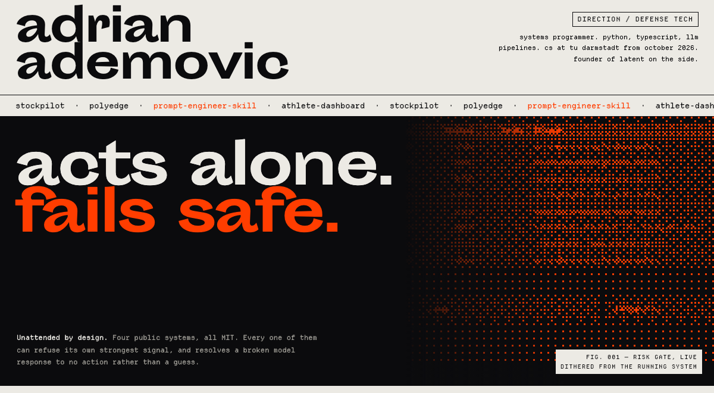

## What I build

Systems that run unattended and fail in a way I can predict.

That is one idea in four places. An equity agent that refuses its own strongest signal when the risk layer says no. A market scanner that resolves a malformed model response to *no signal* rather than a guess. A prompt toolchain that ships the evaluation harness next to the prompt, because a prompt nobody measured is a prompt nobody trusts. A health tracker that puts four vendor silos into one schema so the data can finally be correlated.

**Where I am going.** Defense technology and autonomy — systems that have to act on their own, under uncertainty, and be wrong safely. I have no domain experience there and I am not going to pretend otherwise. What I do have is the engineering habit the domain runs on: hard gates, fail-closed defaults, no-lookahead validation, and a bias against trusting a model's output without a check behind it.

## Systems

| | | |
|---|---|---|
| **[stockpilot](https://github.com/AdrianAdem/stockpilot)** | Autonomous equity agent for Alpaca. Momentum, mean reversion, 13F institutional flow and a two-tier Claude analyst are weighted into one score — which the risk layer is allowed to reject. 0.25% of equity at risk per trade, sector caps, drawdown breakers. Stops rest at the broker as real GTC orders and fire while the bot is offline. | `Python` `asyncio` `FastAPI` `Alpaca` |
| **[polyedge](https://github.com/AdrianAdem/polyedge)** | Event-driven scanner for Polymarket. A cheap Haiku pass filters roughly 1,700 open markets before Sonnet reads the survivors — the tiering is the whole cost design. Quarter-Kelly sizing, paper execution only, every API call logged with tokens, latency and USD. | `Python` `asyncio` `websockets` `SQLite` |
| **[prompt-engineer-skill](https://github.com/AdrianAdem/prompt-engineer-skill)** | An Agent Skill that treats prompt engineering as a procedure. It routes to the right artifact first — hook, skill, subagent or prompt — sizes an eval set to the real volume, and ships a linter and a benchmark. It passes its own linter. | `Python` `Claude Code` `evals` |
| **[athlete-dashboard](https://github.com/AdrianAdem/athlete-dashboard)** | Self-hosted training and health tracker. Strength logging with 1RM analytics, Strava cardio, barcode nutrition and daily Garmin biometrics behind one Postgres schema with row-level security. | `TypeScript` `React 19` `Supabase` |

All MIT, all with architecture notes and setup in their READMEs.

## Stack

**Python** — async, FastAPI, pandas, pytest, ruff. **TypeScript** — React, Supabase, Vite, Tailwind. **LLM pipelines** with the Claude API, as a tool and as a product layer. **Swift/SwiftUI** in the learning phase, and I will say so rather than list it as a skill.

## Also

Computer Science at TU Darmstadt from October 2026. I run [Latent](https://latentdev.de) on the side — web design and AI automation for owner-run businesses around Frankfurt, which is where I learned to ship something a stranger has to use. Karate and Judo.

Open to internships and working-student roles, especially where a system has to act on its own.

[LinkedIn](https://www.linkedin.com/in/adrian-ademovic-75ba6a268/) · [LeetCode](https://leetcode.com/u/Adrian08/) · [ademovic0@web.de](mailto:ademovic0@web.de)
